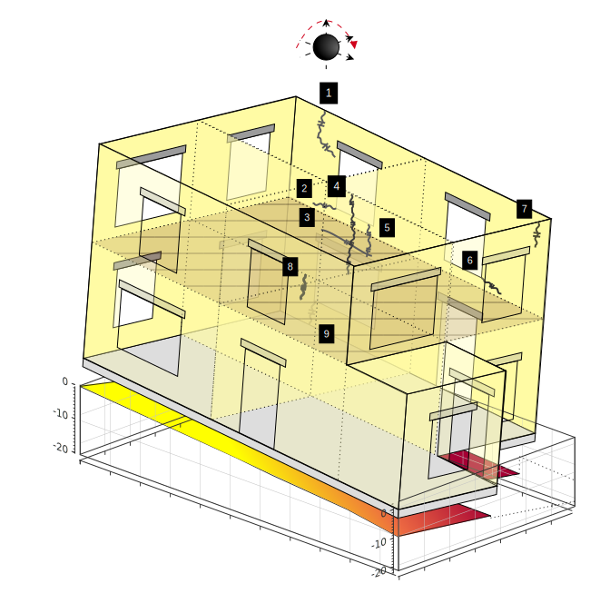

# Bricks

[](https://www.python.org/downloads/)
[](LICENSE)
[](https://github.com/JavFuertes/BRICKS/stargazers)

Due to the Netherlands' topography and geology, many regions have weak soil resistance, causing numerous buildings to experience settlements from subsidence processes, with masonry structures being the most commonly affected. In these buildings, damage typically appears as cracks and deformations, indicating the foundation’s inability to support the structure. To enhance decision-making and the engineering of effective countermeasures in these scenarios, accurate and reliable building assessments are needed to predict the expected damage based on the amount of soil deformations.

Bricks is a module for the analysis of subsidence-affected masonry buildings. It allows the use of analytical tools and Finite Element Models analysis tools used in the analysis of subsidence-affected buildings. 

|  |
|-------------------------------------------------------------------------------------------------|
| **Figure:** Building damage due to subsidence effects                    |

## 🏗️ Module Structure

This module is split into two submodules:

### 📊 Analytical (`bricks.analytical`)

- **house**: Create a detailed digital representation of your building
- **assessment**: Two comprehensive assessment methods:
  - Empirical assessment using proven empirical limits
  - Advanced analytical assessment via the Limit Tensile Strain Method

### 🔧 FEA (`bricks.fea`)

- **analysis**: Powerful analysis of FEM outputs to investigate results, featuring an advanced crack detection algorithm
- **calibration**: Sophisticated Bayesian optimisation-based algorithm for the calibration of FEA parameters through an inverse approach
- **processing**: Efficient scripts for processing output files generated by DIANA FEA

The module breakdown is as follows:

```bash
├── analytical/
│   ├── house.py
│   └── assessment/
│       ├── damage_parameter.py
│       ├── emethods.py
│       ├── ltsm.py
│       ├── sri.py
│       ├── utils.py
│       ├── elimits_db/
│       │   ├── elimits_epsilon.py
│       │   └── elimits_sri.py
│       └── tools/
│           ├── report.py
│           ├── utils.py
│           └── plots/
│               ├── building.py
│               ├── em_plot.py
│               ├── ltsm_plot.py
│               └── surface_plot.py
└── fea/
    ├── analysis/
    │   ├── crackdetection.py
    │   ├── main.py
    │   ├── out.py
    │   └── tabulated.py
    ├── calibration/
    │   ├── initiate.py
    │   ├── main.py
    │   ├── material.py
    │   ├── optimize.py
    │   ├── utils.py
    │   └── wall.py
    ├── plots/
    │   ├── plots.py
    │   ├── style.py
    │   └── utils.py
    └── processing/
        ├── out.py
        ├── script.py
        ├── script_template.py
        └── tabulated.py
```

## ⚙️ Installation

Install the module through the following command:

```bash
pip install git+https://github.com/JavFuertes/BRICKS.git@main
```

## 📝 Citation and Acknowledgements

The references used to make this module can be found in the following thesis. This thesis can also be used as a reference when using `Bricks`:

> Fuertes, J. (2024). Calibrated Numerical Models for Masonry Buildings Subjected to Subsidence-Related Ground Settlements [Master's thesis, Delft University of Technology]. TU Delft Repository. https://resolver.tudelft.nl/uuid:b35ef3f8-48d8-46ed-861e-774632bf238b

## 🔧 Requirements


