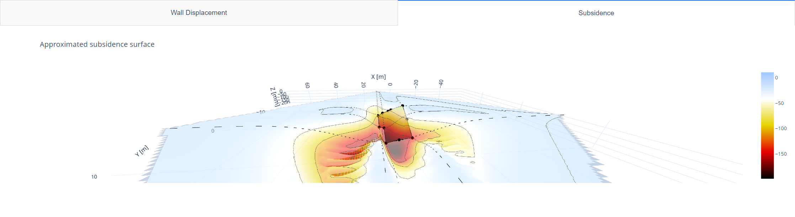
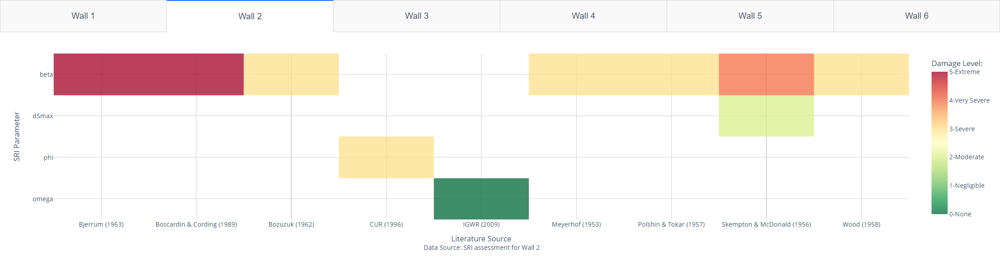

# Bricks.Analytical

In the Netherlands, engineering consultants often inspect buildings affected by subsidence. These assessments compile key details, including:

- **Building Information**: Construction year, major renovations, and historical details.
- **Damage Documentation**: Photos highlighting damage severity and locations.
- **Measurement Campaign**: Data on structural distortions shown in skew measurement graphs.
- **Soil Analysis**: Soil load-bearing capacity and foundation layout relative to underlying strata.

The goal of **Bricks.Analytical** is to provide tools that leverage the information from these inspection in order for the evaluation of the structural vulnerability of the structures to be made. Thus, helping engineers make reliable assessments efficiently.

|  |
|---------------------------------------------------------------------------------------------------------|
| **Figure 1:** Masonry structure accommodating to a subsidence surface |


The module is split into two submodules firstly, 

## Overview of the `bricks.analytical` Module

The Bricks module is designed to support engineers and homeowners in the Netherlands with tools to evaluate building vulnerability. The module includes three primary components:

1. **`analytical.house`**: A class to create a building object, enabling the processing of structural and soil characteristics necessary for further analysis.
2. **`analytical.assessment`**: Contains advanced techniques to perform a preliminary vulnerability assessment. Currently, methods include `assess.py` with options like LTSM and empirical threshold-based assessments of structural KPIs. These methods provide quick insights, though some lack the precision of more advanced FEM approaches.
3. **`analytical.assessment.tools`**: A set of visualization tools to help interpret assessment results and visualize the building's current condition.

An example notebook, `bricks_analytical.ipynb`, demonstrates the module's features against the measurements of a case-study, used to assess a structure and utilize the visualization tools in Bricks.

## Steps for Conducting Your Own Assessment

### 1. Set Up Your Building Object and Calculate Key Values

Using data from a building assessment report or self-recorded measurements, define the building's geometry and subsidence measurements.

```python
walls = {
    'wall1':{"x": np.array([0, 0, 0]), "y": np.array([0, 3.5, 7]), "z": np.array([0, -72, -152]), 'phi': np.array([1/200,1/200]), 'height': 5000, 'thickness': 27},
    'wall2':{"x": np.array([0, 4.5, 8.9]), "y": np.array([7, 7, 7]), "z": np.array([-152, -163, -188]),  'phi': np.array([1/33,1/50]), 'height': 5000, 'thickness': 27},
}

example_building = house(measurements=walls)
```

Calculate the **Soil-related Intensity Factors** using the SRI method:

```python
example_building.SRI()
```

|     | Smax | dSmax |       D/L |   drat |   omega |     phi |     beta |
|-----|------|-------|-----------|--------|---------|---------|----------|
| **0** |  152 |   152 | 21.714286 |  4.000 | 1.524776| 1.524776| 3.049552 |
| **1** |  188 |    36 |  4.044944 |  7.202 | 1.328434| 1.328434| 2.656867 |
| **2** |  188 |    39 | 11.470588 |  0.000 | 1.483837| 1.483837| 0.000000 |

**Table 1:** Settlement-related intensity factors

Visualize the building’s displacement field by interpolating data and fitting a subsidence model, typically a **Gaussian shape**.

```python
example_building.interpolate()
example_building.fit_function(i_guess=1, tolerance=1e-2, step=1)
plots.subsidence(example_building, building=False, soil=True, deformation=True)
```

|  |
|-------------------------------------------------------------------------------------------------------------|
| **Figure 5:** Approximate soil surface for Ijsselsteinseweg 77 |

---

### 2. Conduct a Preliminary Building Assessment

The module provides two main approaches for building assessments: empirical methods and the LTSM.

#### 2.1 Empirical Method Assessment

Assess building vulnerability using empirical methods that compile limits from research correlating structural KPIs to damage levels.

```python
example_building.SRI(tolerance=0.01) # Compute SRI parameters
report = EM(example_building.soil['sri'])

app = EM_plot(report)
app.run_server(port=8051, debug=False)
```

|  |
|----------------------------------------------------------------------------|
| **Figure 6:** Matrix of results from various empirical assessment methods |

#### 2.2 LTSM Assessment (Burland & Wroth, 1974)

The **LTSM** method, based on Burland & Wroth's model, simplifies the building as a masonry beam undergoing subsidence. This method evaluates building strains in response to subsidence-induced stresses.

```python
limit_line = -1
eg_rat = 2.6  # May vary based on calibration

LTSM(example_building, limit_line, eg_rat, save=True)
app = plots.LTSM_plot(example_building)
app.run_server(debug=False)
```

|  |
|---------------------------------------------------------------------|
| **Figure 7:** Visualization of LTSM results |
